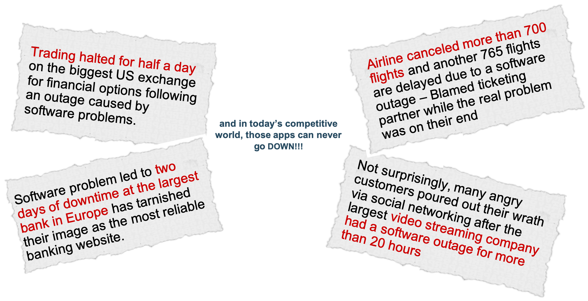
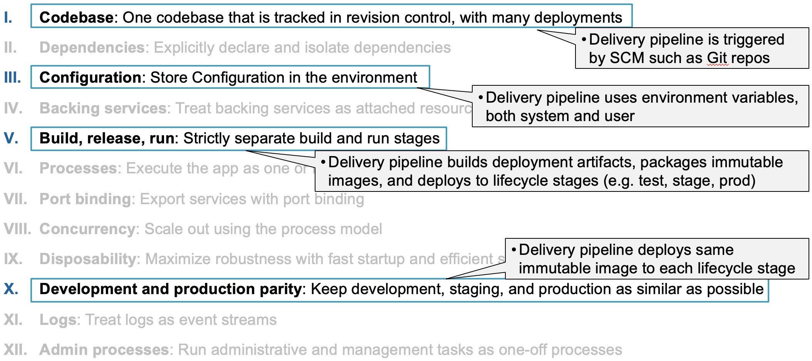
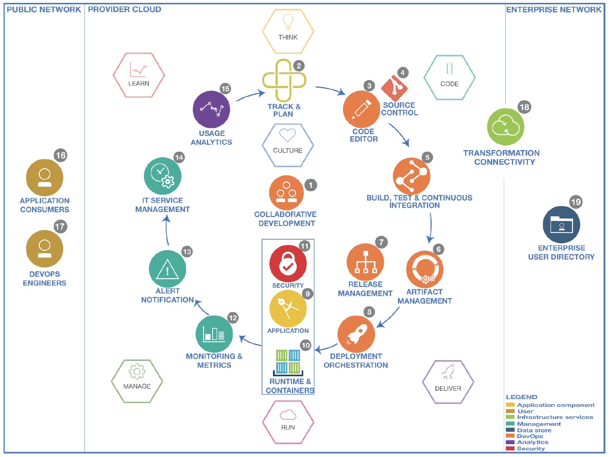
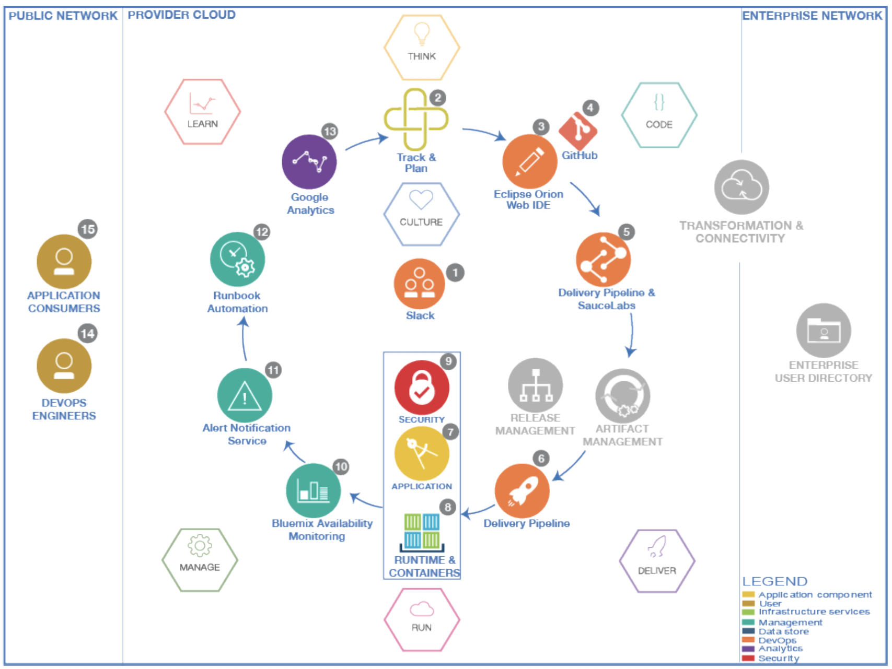

# DevOps Introduction

DevOps has recently become a popular buzzword in the Cloud World. It varies from business to business and it means a lot different things to different people. In traditional IT, organizations have separate teams for Development and Operations. The development team is responsible for coding and operations team is responsible for releasing it to production. When it comes to this two different teams, there will always be some sort of differences. It may be due to the usage of different system environments, software libraries etc. In order to level this up, DevOps came into play.

## What is DevOps ?

“DevOps is a philosophy, a cultural shift that merges operations with development and demands a linked toolchain of technologies to facilitate collaborative change. DevOps toolchains … can include dozens of non-collaborative tools, making the task of automation a technically complex and arduous one.” - Gartner

These days every business has critical applications which can never go down. Some of the examples are as follows.

In order to make sure that these applications are up and running smoothly, we need DevOps.

Adopting DevOps allows enterprises to create, maintain and improve their applications at a faster pace than the traditional methods. Today, most of the global organizations adopted DevOps.

## Presentations

[Tekton Overview :fontawesome-regular-file-pdf:](./materials/04-Tekton-Overview.pdf){ .md-button }

## Benefits of DevOps

- Continuous software delivery
- High quality software
- Increased speed and faster problem resolution
- Increased reliability
- Easier to manage the software
- Collaboration and enhanced team communication
- Customer satisfaction etc.

## Understanding DevOps

Like we mentioned before, often development teams and operation teams are in conflict with each other. Developers keeping changing the software to include new features where as operation engineers wants to keep the system stable.

- Their goals are different.
- They use different processes.
- They use different tools.

All these may be different reasons for the gap between these two teams.

To solve this gap between the two teams, we need DevOps. It closes the gap by aligning incentives and sharing approaches for tools and processes. It helps us to streamline the software delivery process. From the time we begin the project till its delivery, it helps us to improve the cycle time by emphasizing the
learning by gathering feedback from production to development.

It includes several aspects like the below.

- Automation - It is quite essential for DevOps. It helps us to gather quick feedback.
- Culture - Processes and tools are important. But, people are always more important.
- Measurement - Shared incentives are important. Quality is critical.
- Sharing - Need a Culture where people can share ideas, processes and tools.

<iframe
  width="560"
  height="315"
  src="https://www.youtube.com/embed/UbtB4sMaaNM"
  frameborder="0"
  allow="accelerometer; autoplay; clipboard-write; encrypted-media; gyroscope; picture-in-picture"
  allowfullscreen
></iframe>

## Where to start ?

Understanding the eco system of your software is important. Identify all the environments like dev, test, prod etc. you have in your system and how the delivery happens from end to end.

- Define continuous delivery
- Establish proper collaboration between teams
- Make sure the teams are on same pace
- Identify the pain points in your system and start working on them.

## DevOps Best Practices

These are some of the standard practices adopted in DevOps.

- Source Code Management
- Code Review
- Configuration Management
- Build Management
- Artifact Repository Management
- Release Management
- Test Automation
- Continuous Integration
- Continuous Delivery
- Continuous Deployment
- Infrastructure As Code
- Automation
- Key Application Performance Monitoring/Indicators

**Source Code Management**

Source Code Management (SCM) systems helps to maintain the code base. It allows multiple developers to work on the code concurrently. It prevents them from overwriting the code and helps them to work in parallel from different locations.

Collaboration is an important concept in devOps and SCM helps us to achieve it by coordination of services across the development team. It also tracks co-authoring, collaboration, and individual contributions. It helps the developers to audit the code changes. It also allows rollbacks if required. It also enables backup and allows recovery when required.

**Code Review**

Code reviews allows the developer to improve the quality of code. They help us to identify the problems in advance. By reviewing the code, we can fix some of the problems like memory leaks, buffer overflow, formatting errors etc.

This process improves the collaboration across the team. Also, code defects are identified and removed before merging them with the main stream there by improving the quality of the code.

**Configuration Management**

Configuration Management is managing the configurations by identifying, verifying, and maintaining them. This is done for both software and hardware. The configuration management tools make sure that configurations are properly configured across different systems as per the requirements.

This helps to analyze the impact on the systems due to configurations. It makes sure the provisioning is done correctly on different systems like dev, QA, prod etc. It simplifies the coordination between development and operations teams.

**Build Management**

Build Management helps to assmble the build environment by packaging all the required components such as the source code, dependencies, etc of the software application together in to a workable unit. Builds can be done manually, on-demand or automated.

It ensures that the software is stable and it is reusable. It improves the quality of the software and makes sure it is reliable. It also increases the efficiency.

**Artifact Repository Management**

Artifact Repository Management system is used to manage the builds. It is dedicated server which is used to store all the binaries which were outputs of the successful builds.

It manages the life cycles of different artifacts. It helps you to easily share the builds across the team. It controls access to the build artifacts by access control.

**Release Management**

Release management is a part of software development lifecycle which manages the release from development till deployment to support. Requests keep coming for the addition of the new features. Also, sometimes there may be need to change the existing functionality. This is when the cycle begins for the release management. Once, the new feature or change is approved, it is designed, built, tested, reviewed, and after acceptance, deployed to production. After this, it goes to maintainence and even at this point, there may be need for enhancement. If that is the case, it will be a new cycle again.

It helps us to track all the phases and status of deployments in different environments.

**Test Automation**

Manual testing takes lots of time. We can automate some of the manual tests which are repetitive, time consuming, and have defined input by test automation.

Automatic tests helps to improve the code quality, reduces the amount of time spent on testing, and improves the effectiveness of the overall testing life cycle.

**Continuous Integration**

Continuous integration allows the developers to continuously integrate the code they developed. Whenever a latest code change is made and committed to the source control system, the source code is rebuilt and this is then forwarded to testing.

With this, the latest code is always available, the builds are faster and the tests are quick.

**Continuous Delivery**

Continuous Delivery is the next step to Continuous Integration. In the integration, the code is built and tested. Now in the delivery, this is taken to staging environment. This is done in small frequencies and it makes sure the functionality of the software is stable.

It reduces the manual overhead. The code is continuously delivered and constantly reviewed.

**Continuous Deployment**

Continuous Deployment comes after Continuous Delivery. In the deployment stage, the code is deployed to the production environment. The entire process is automated in this stage.

This allows faster software releases. Improves the collaboration across the teams. Enhances the code quality.

**Infrastructure As Code**

Infrastructure as Code is defining the infrastructure services as a software code. they are defines as configuration files. Traditionally, in on-premise application, these are run by system administrators but in cloud, the infrastructure is maintained like any other software code.

Helps us to change the system configuration quickly. Tracking is easy and end to end testing is possible. Infrastructure availability is high.

**Automation**

Automation is key part to DevOps. Without automation, DevOps is not efficient.

Automation comes into play whenever there is a repetitive task. Developers can automate infrastructure, applications, load balancers, etc.

**Key Application Performance Monitoring/Indicators**

DevOps is all about measuring the metrics and feedback, with continuous improvement processes. Collecting metrics and monitoring the software plays an important role. Different measures like uptime versus downtime, resolutions time lines etc. helps us to understand the performance of the system.

## Devops in Twelve factor apps

If you are new to Twelve factor methodology, have a look [here](https://12factor.net/). For more details, checkout [Cloud-Native module](https://github.ibm.com/CASE/cloudnative-bootcamp/tree/master/Cloud_Native_Module).

## DevOps Reference Architecture

1. Collaboration tools enable a culture of innovation. Developers, designers, operations teams, and managers must communicate constantly. Development and operations tools must be integrated to post updates and alerts as new builds are completed and deployed and as performance is monitored. The team can discuss the alerts as a group in the context of the tool.
2. As the team brainstorms ideas, responds to feedback and metrics, and fixes defects, team members create work items and rank them in the backlog. The team work on items from the top of the backlog, delivering to production as they complete work.
3. Developers write source code in a code editor to implement the architecture. They construct, change, and correct applications by using various coding models and tools.
4. Developers manage the versions and configuration of assets, merge changes, and manage the integration of changes. The source control tool that a team uses should support social coding.
5. Developers compile, package, and prepare software assets. They need tools that can assess the quality of the code that is being delivered to source control. Those assessments are done before delivery, are associated with automated build systems, and include practices such as code reviews, unit tests, code quality scans, and security scans.
6. Binary files and other output from the build are sent to and managed in a build artifact repository.
7. The release is scheduled. The team needs tools that support release communication and managing, preparing, and deploying releases.
8. The team coordinates the manual and automated processes that are required for the solution to operate effectively. The team must strive towards continuous delivery with zero downtime. A/B deployments can help to gauge the effectiveness of new changes.
9. The team must understand the application and the options for the application's runtime environment, security, management, and release requirements.
10. Depending on the application requirements, some or all of the application stack must be considered, including middleware, the operating system, and virtual machines.
11. The team must ensure that all aspects of the application and its supporting infrastructure are secured.
12. The team plans, configures, monitors, defines criteria, and reports on application availability and performance. Predictive analytics can indicate problems before they occur.
13. The right people on the team or systems are notified when issues occur.
14. The team manages the process for responding to operations incidents, and delivers the changes to fix any incidents.
15. The team uses analytics to learn how users interact with the application and measure success through metrics.
16. When users interact with the application, they can provide feedback on their requirements and how the application is meeting them, which is captured by analytics as well.
17. DevOps engineers manage the entire application lifecycle while they respond to feedback and analytics from the running application.
18. The enterprise network is protected by a firewall and must be accessed through transformation and connectivity services and secure messaging services.
19. The security team uses the user directory throughout the flow. The directory contains information about the user accounts for the enterprise.

For a cloud native implementation, the reference architecture will be as follows.

## References

- [Michael Hüttermann (2012). DevOps for Developers. Publisher: Apress] (https://learning.oreilly.com/library/view/devops-for-developers/9781430245698/)
- [Sricharan Vadapalli (2018). DevOps: Continuous Delivery, Integration, and Deployment with DevOps. Publisher: Packt Publishing] (https://learning.oreilly.com/library/view/devops-continuous-delivery/9781789132991/)
- [DevOps Architecture] (https://www.ibm.com/cloud/garage/architectures/devOpsArchitecture/0_1)